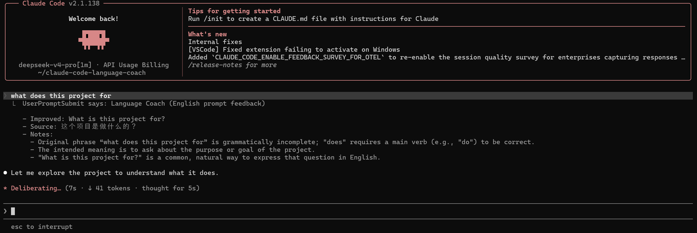

**English** | [简体中文](./README.zh-CN.md)

# Claude Code Language Coach Plugin

This Claude Code plugin gives prompt-level language feedback before Claude processes your message.

- If your prompt is already in your chosen target language, it checks grammar and suggests a more natural version.
- If your prompt is in another language, it translates it into a concise Claude Code prompt in your chosen target language.

Feedback is shown through a hook `systemMessage`. **The suggestions are visible in Claude Code but are not inserted into Claude's model context.**



## Install

Inside Claude Code, add the marketplace and install the plugin:

```text
/plugin marketplace add jiang1997/claude-code-language-coach
/plugin install language-coach@language-coach
```

## Configure

When enabling the plugin, Claude Code prompts for the required settings:

- `api_key`: API key for your OpenAI-compatible provider
- `base_url`: provider base URL, for example `https://api.openai.com/v1`
- `model`: model name accepted by that provider

After installation, open the plugin manager (`/plugin` → Installed → Language Coach) to adjust these optional settings:

- `timeout_ms`: request timeout, default `60000`
- `max_prompt_chars`: skip prompts longer than this, default `4000`
- `target_language`: the language to translate into or check against, default `English`
- `source_language`: optional native/source language. When set, the tutor adds a back-translation into this language when your prompt is written in another language, default empty

For local development or non-interactive testing, the hook also accepts environment variables:

```sh
export LC_HELPER_API_KEY="..."
export LC_HELPER_BASE_URL="https://api.openai.com/v1"
export LC_HELPER_MODEL="gpt-4o-mini"
```

The script also recognizes `OPENAI_API_KEY`, `OPENAI_BASE_URL`, `OPENAI_API_BASE`, and `OPENAI_MODEL`.

## Prerequisites

- Node.js 18 or later (the hook uses the global `fetch` API)

## Privacy

This hook sends each handled prompt to the configured external model provider before Claude processes it. Prompts that look like long code blocks or logs are skipped, but you should still avoid using the plugin with sensitive prompts unless you trust the configured provider.
