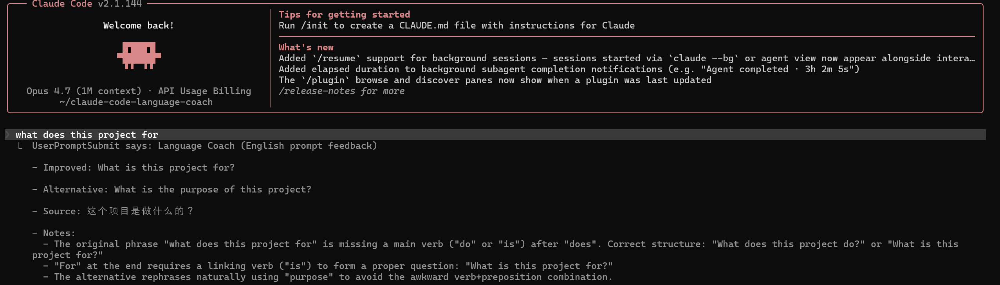
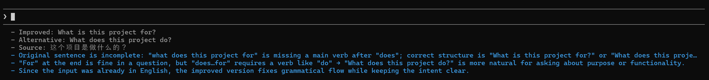

[English](README.md) | [简体中文](README.zh-CN.md)

# Claude Code Language Coach Monorepo

This repository contains two versions of the Language Coach plugin for Claude Code.

Write Claude Code prompts in languages you're not fluent in — with grammar checks, translation, and back-translation to verify your intent.

- If your prompt is already in your chosen target language, it checks grammar and suggests a more natural version.
- If your prompt is in another language, it translates it into a concise Claude Code prompt in your chosen target language.
- Set an optional `source_language` to see a back-translation, so you can verify the translated prompt still means what you intended.

**Neither version modifies your input.** The feedback is visible only to you and is never inserted into Claude's model context.

## Comparison

| Feature | [Original (Recommended)](./plugins/language-coach) | [Statusline](./plugins/language-coach-statusline) |
| :--- | :--- | :--- |
| **Delivery** | Inline system message in chat | CLI Status Line (footer) |
| **UX** | Delays Claude's response slightly | Instant response (runs in background) |
| **Visibility** | Prominent, before Claude's reply | Subtle, appears during/after reply |
| **Setup** | Configure API key, base URL, and model | Configure API + manual `settings.json` edit |

## Plugins

### 1. [Language Coach (Original)](./plugins/language-coach) (Recommended)
The classic version that provides blocking, inline feedback before each prompt.



**Install:**

1. Add the marketplace:
   ```text
   /plugin marketplace add jiang1997/claude-code-language-coach
   ```

2. Install the plugin:
   ```text
   /plugin install language-coach@language-coach
   ```

3. **Configure** — open the plugin manager (`/plugin` → Installed → Language Coach) and set:
   - `api_key`: Your OpenAI-compatible API key
   - `base_url`: Provider base URL (e.g. `https://api.openai.com/v1`)
   - `model`: Model name accepted by that provider

### 2. [Language Coach Statusline](./plugins/language-coach-statusline)
The non-blocking version that provides feedback in the CLI status line.



**Install:**

1. Add the marketplace:
   ```text
   /plugin marketplace add jiang1997/claude-code-language-coach
   ```

2. Install the plugin:
   ```text
   /plugin install language-coach-statusline@language-coach
   ```

3. **Configure** — same API settings as the Original version (`api_key`, `base_url`, `model`).

**Mandatory Setup:**
To see the feedback, you **must** add a `statusLine` entry to your `~/.claude/settings.json`:
```json
{
  "statusLine": {
    "type": "command",
    "command": "node /absolute/path/to/plugins/language-coach-statusline/scripts/language-statusline.js",
    "refreshInterval": 3
  }
}
```
*(Tip: Use `find ~/.claude/plugins -name language-statusline.js` to find the absolute path after installation.)*

---

## Development

Because this is a monorepo, you must point the CLI to a specific sub-directory when testing locally:

**To develop the Original version:**
```bash
claude --plugin-dir ./plugins/language-coach
```

**To develop the Statusline version:**
```bash
claude --plugin-dir ./plugins/language-coach-statusline
```
